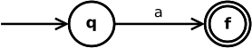
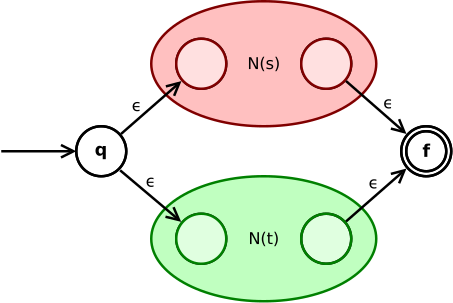
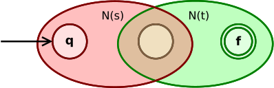
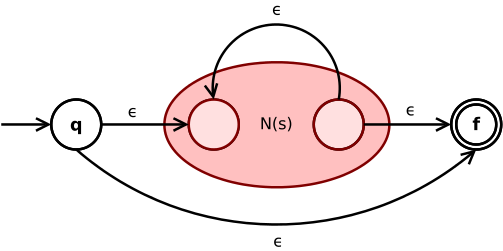
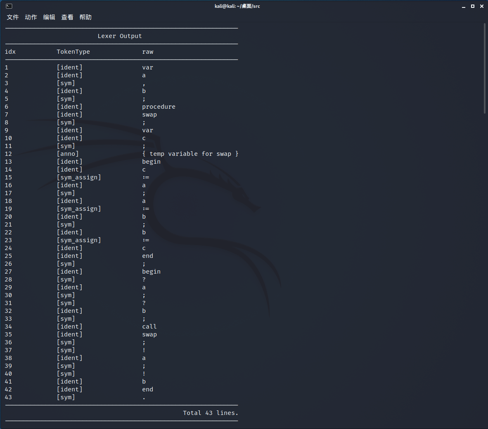
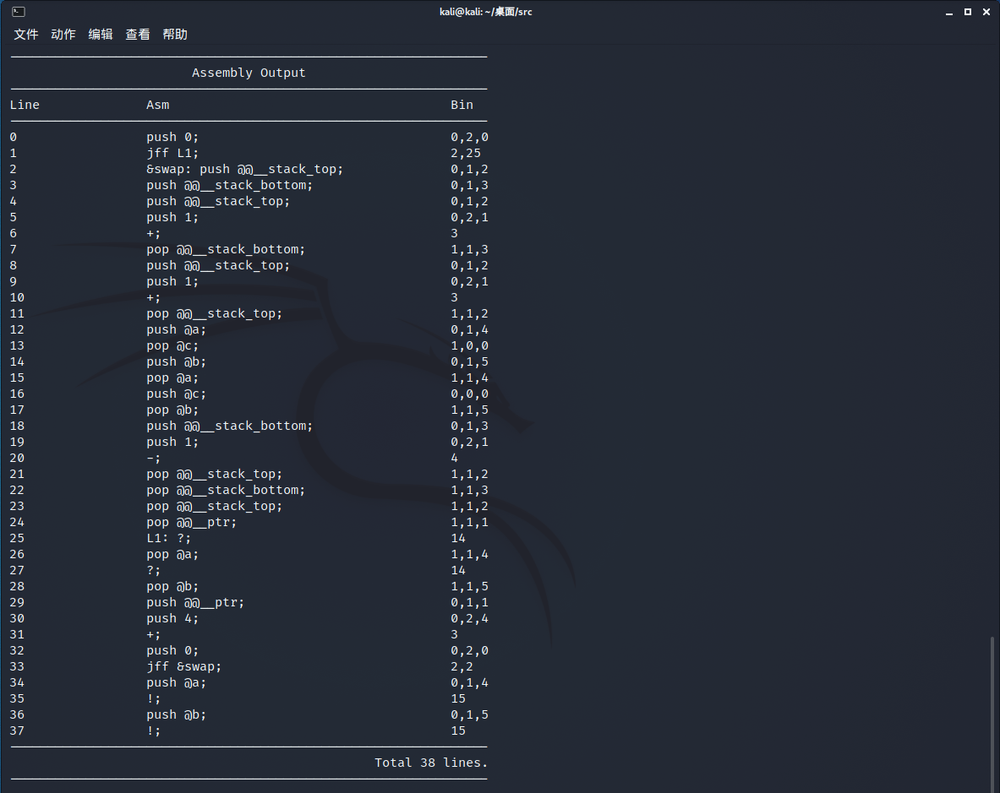

# YYACC

Yet Yet Another Compiler Compiler

---

# Construction of Compiler Framework and a PL/0 Language Interpreter Implementation

## Regex for tokens

- number：`[0-9][0-9]*`
- Identifier：`[_a-zA-Z][_a-zA-Z0-9]*`
- assignment synbol：`\:\=`
- less than or equal to：`\<\=`
- greater than or equal to：`\>\=`
- other symbols：`[!?:;.,#<=>+-\*/\(\)]`
- comment：`\{[\f\n\r\t\v -z|~]*\}`
- white space chars：`[ \f\n\r\t\v][ \f\n\r\t\v]*`

## Automaton architecture

A automaton can be represented by a 5-element tuple $(Q,\Sigma,\delta,q _ 0,F)$.

- $Q$ is state set
- $\Sigma$ is char set
- $\delta(q,c)$ is dual transition function
  - the state-set reached from state-q through transition by char-c
- the initial state is $q _ 0$, and final(termination) state-set is $F$

For simpleicity, we note $\hat\delta(q,cw)=\hat\delta(\delta(q,c),w),(w \in \Sigma^*)$.

It is easy to observe that both DFA and NFA belong to automata, but their transition functions have different definitions(NFA is `vector<vector<set<int>>>`, DFA is `vector<vector<int>>`).

Consider using template classes for different types of inheritance.

``` cpp
template<typename T_Delta, typename T_F, typename T_isend>
class Automachine {
public:
    int Q;         // node count (index from 1)
    int Sigma;     // alphabet size
    T_Delta Delta; // δ(q,w)
    int q0;        // start state(node)
    T_F F;         // final state
    T_isend isend; // setted if is at final state
    Automachine() {}
    Automachine(int Q, int Sigma, T_Delta Delta, int q0, T_F F, T_isend isend):
        Q(Q), Sigma(Sigma), Delta(Delta), q0(q0), F(F), isend(isend) {};
};
class NFA: private Automachine<NFA_Delta, NFA_F, NFA_isend>; // NFA = (Q, Σ, δ, q0, F)
class DFA: private Automachine<DFA_Delta, DFA_F, DFA_isend>; // DFA = (Q, Σ, δ, q0, F)
```

### Termination state from Regex to ε- NFA (Thompson Construction Method)

By using the following transformation, regular expressions can be constructed into equivalent ε-NFA.

- empty expression `ε`:
  
- single symbol `a`:
  
- the union of expressions `(s|t)`
  
- the link of two expressions `(st)`:
  
- the Kleen closure `(s*)`:
  

### From ε-NFA to NFA (remove ε)

Let $\epsilon(q)=\{p|\hat \delta(q,\varepsilon)=p\}$ to represent the state-set reached by ε-edge from state-q.

Therefore, $\forall c \in \Sigma,\delta_{NFA}(E(q),c)=\{\cup_{p \in S} E(p)|S=\{r|\delta(q,c)=r\} \}$.

In fact, it is to represent the process of simulating ε-NFA with a simplified state set.

### From NFA to DFA (determine NFA)

We use subset construction method.

Similar to the step of simplify ε-NFA, we note $\Gamma _ c(q)= \{ p|\delta(q,c)=p \}$.

Then the DFA is designed like this: initial state is $\{ q _ 0 \}$, transition function is $\delta_{DFA}(S,c)=\cup_{p \in S} \Gamma_c(p)$.

It's important that:

1. using hash algorithm to make mappings and it's also workable using `map<set<int>, int>`.
2. determining NFA through subset construction method, it's based on BFS algorithm, which means using `queue<set<int>> que;` to restore state set S, and update it each time by taking the first element of the queue.

### From DFA to MFA (minimize DFA)

最小化DFA有许多算法，这里选用比较直接的**填表算法**。

定义 $p,q$ 状态相同，当且仅当 $\forall w\in\Sigma^+,s.t.\hat \delta(p,w)=\hat \delta(q,w)$，换而言之：若 $\exists w \in \Sigma^+,s.t.\hat\delta(p,w) \ne \hat \delta(q,w)$，则 $p,q$ 状态不相同。

首先，若 $p \in F,q \not \in F$，则 $p,q$ 不同；其次，若 $\delta(p,c)=p',\delta(q,c)=q'$ 且 $p',q'$ 不同，则 $p,q$ 不同；同时，若 $p,q$ 不同，则存在串 $w$，使得 $\hat\delta(p,w) \in F,\hat\delta(q,w)\not\in F$ 或相反。

所以可以再次使用广度优先搜索算法，初始时将所有满足 $p \in F,q \ne F$ 的 $(p,q)$ 点对加入队列，然后依次消除所有的不等价点对，最后剩下的点对就是所有的等价类。

之后只需要删除所有的不可从初始节点到达的节点就可以转化为MFA了；为了更容易实现字符串匹配，这里可以稍微破坏DFA的结构，即将所有不能到达终止节点的节点删除。

### MFA匹配字符串

这里的技术难点主要分为如何利用预编译好的**DFA进行字符串匹配**，以及如何优美的**读入绑定结构**。

线性扫描字符串的时候，依次使用每一个DFA进行贪心匹配。

``` cpp
void match(string str) {
    int len = str.length(), ptr = 0;
    while(ptr < len) { // analyse raw code
        walka(&hk, hooks) {
            auto &raw = get<0>(hk);
            auto &act = get<1>(hk);
            auto &dfa = get<2>(hk);
            raw = "", dfa.resetState();
            int ptrmem = ptr, isendstate = 0;
            while(ptr < len && dfa.test(str[ptr])) {
                isendstate = dfa.feed(str[ptr]);
                raw += str[ptr ++];
            }
            if(isendstate) { // state in `endF`, and we catched a string!
                act(raw);
                goto nxt;
            } else {
                ptr = ptrmem;
            }
        }
        errorlog("error in `match`: can't match any regex, char: %c (ascii: %d)", str[ptr], (int) str[ptr]);
        nxt: ;
    }
}
```

对于绑定匹配模式和匹配回调函数，这里通过 `Lexer& f() { return *this; }` 的方法，实现连续调用。

``` cpp
lexer.feed("[0-9][0-9]*",
           [&](string raw) {
               bpb("[number]", raw);
               tpb(TokenType :: number, raw);
           })
    .feed("[_a-zA-Z][_a-zA-Z0-9]*", // identifiers 
          [&](string raw) {
              bpb("[ident]", raw);
              tpb(TokenType :: ident, raw);
          });
```

## 设计LL(1)文法

这里先给出EBNF范式的PL/0文法：

``` pascal
program = block "." ;
block = [ "const" ident "=" number {"," ident "=" number} ";"]
        [ "var" ident {"," ident} ";"]
        { "procedure" ident ";" block ";" } statement;
statement = [ ident ":=" expression | "call" ident 
              | "?" ident | "!" expression 
              | "begin" statement {";" statement } "end" 
              | "if" condition "then" statement 
              | "while" condition "do" statement ];
condition = "odd" expression |
            expression ("="|"#"|"<"|"<="|">"|">=") expression;
expression = [ "+"|"-"] term { ("+"|"-") term};
term = factor {("*"|"/") factor};
factor = ident | number | "(" expression ")";
```

由于Parser部分使用RDP实现，所以只需要去除**左递归**即可（不一定需要完全达到LL(1)），只需要增加后缀部分拆分左递归式。

原始版本的PL/0对负数支持不太好，这里重写了部分定义。

``` pascal
<program> = <block> "."
<block> = <constdef> <vardef> <procdef> <statement>
<constdef>    = "const" <ident> "=" <number> <constdefpri> ";"
              | ""
<constdefpri> = "," <ident> "=" <number> <constdefpri>
              | ""
<vardef>    = "var" <ident> <vardefpri> ";"
            | ""
<vardefpri> = "," <ident> <vardefpri>
            | ""
<procdef> = "procedure" <ident> ";" <constdef> <vardef> <statement> ";" <procdef>
          | ""
<statement>    = <ident> ":=" <expression>
               | "call" <ident> 
               | "?" <ident>
               | "!" <expression> 
               | "begin" <statement> <statementpri> "end" 
               | "if" <condition> "then" <statement>
               | "while" <condition> "do" <statement>
<statementpri> = ";" <statement> <statementpri>
               | ""
<condition> = "odd" <expression>
            | <expression> "="  <expression>
            | <expression> "#"  <expression>
            | <expression> "<"  <expression>
            | <expression> "<=" <expression>
            | <expression> ">"  <expression>
            | <expression> ">=" <expression>
<expression>    = <term> <expressionpri>
                | "+" <term> <expressionpri>
                | "-" <term> <expressionpri>
<expressionpri> = "+" <term> <expressionpri>
                | "-" <term> <expressionpri>
                | ""
<term>    = <factor> <termpri>
<termpri> = "*" <factor> <termpri>
          | "/" <factor> <termpri>
          | ""
<factor> = <ident>
         | <number>
         | "(" <expression> ")"
         | "+" "(" <expression> ")" // extra
         | "-" "(" <expression> ")" // extra
         | "+" <number> // extra
         | "-" <number> // extra
         | "+" <ident>  // extra
         | "-" <ident>  // extra
<ident>  = `IDENT`
<number> = `NUMBER`
```

如何处理带符号表达式是这部分的主要难点，诸如 `-114` 或者 `+514` 之类的数字，又或者说是 `-homo` 这类的变量，再或者说是 `+(1919/810)` 这类的表达式前的符号。可以考虑将它们都归结到 `<factor>` 中实现，即增加前缀符号识别。

## 解析抽象语法树

这里使用的是**递归下降子程序法**解析抽象语法树，大体思路就是，通过递归函数栈来模拟匹配文法。

通过构造抽象转移图的方式存储CFG格式，进而模拟进行递归下降子程序法进行解析。

通过宏定义，将中间节点和终止节点的使用变得容易；Node通过返回自身地址，实现连续操作。

``` cpp
#define T(val) (parser.getTerminalNode(val))      // Terminal
#define N(name) (parser.getNonterminalNode(name)) // Nonterminal
N(statement) -> add({ N(ident), T(":="), N(expression) })
    -> add({ T("call"), N(ident) })
    -> add({ T("?"), N(ident) })
    -> add({ T("!"), N(expression) })
    -> add({ T("begin"), N(statement), N(statementpri), T("end") })
    -> add({ T("if"), N(condition), T("then"), N(statement) })
    -> add({ T("while"), N(condition), T("do"), N(statement) });
```

## 设计汇编原型与编译模式

首先设计基础汇编指令，一共分为 $16$ 个基础指令，依次表示数据入栈、将栈顶数据弹出到变量、条件跳转、四则运算、条件判断（`odd` 表示判断是否是奇数，`#` 表示不等于）、控制台输入（`?`）和控制台输出（`!`）。

``` text
push, pop, jff, +, -, *, /, odd, =, #, <, <=, >, >=, ?, !
```

- `push x` 会将立即数 $x$ 压入栈顶，`push @x` 会将变量 `@x` 的值压入栈顶。
- `pop @x` 会将栈顶元素弹出，并赋值给变量 `@x`。
- `jff label` 会先弹出栈顶元素，如果栈顶元素为 $0$，则跳转到位置 `label`。 
- `+, -, *, /, =, #, <, <=, >, >=` 会弹出栈顶两个元素 $x_1,x_2$，然后将 $x_1 \oplus x_2$ 压入栈顶。
- `odd` 会弹出栈顶元素 $x$，如果 $x$ 是奇数，则压入 $1$，否则压入 $0$。
- `?` 会从控制台读入一个整数（int类型），并压入栈顶。
- `!` 会弹出栈顶元素并将其输出。

以下是详细的编译模式。

``` pascal
"const" <ident> "=" <number> <constdefpri> ";"  {  }  // 这部分在编译部分直接进行变量替换
"var" <ident> <vardefpri> ";" { push @@__stack_top; push <vert_ident>; +; pop @@__stack_top; } // 间接填充
"procedure" <ident> ";" <constdef> <vardef> <statement> ";" <procdef>
{
    push 0;
    jff nxt;
    &<ident>:;
    push @@__stack_top;
    push @@__stack_bottom;
    push @@__stack_top;
    push 1;
    +;
    pop @@__stack_bottom;
    [<constdef>]
    <vardef>
    <statement>
    push @@__stack_bottom;
    push 1;
    -;
    pop @@__stack_top;
    pop @@__stack_bottom;
    pop @@__stack_top;
    pop @@__ptr;
    nxt:;
}
<ident> ":=" <expression>  { <expression>; pop @<ident>; }
"call" <ident>    { push @@__ptr; push 4; +; push 0; jff &<ident>; }
"?" <ident>       { ?; pop @<ident>; }  // ?读入到栈顶,复用pop
"!" <expression>  { <expression>; !; }  // !输出栈顶并弹出,复用<expression>
"begin" <statement> <statementpri> "end"  { <statement> }
"if" <condition> "then" <statement>       { <condition>; jff nxt; <statement>; nxt:; } // 如果<condition>为false则跳转(jump if false)
"while" <condition> "do" <statement>      { beg:; <condition>; jff nxt; <statement>; push 0; jff beg; nxt:; }
"odd" <expression>                { <expression>; odd; }
<expression> "="  <expression>    { <expression1>; <expression2>; =; }
<expression> "#"  <expression>    { <expression1>; <expression2>; #; }
<expression> "<"  <expression>    { <expression1>; <expression2>; <; }
<expression> "<=" <expression>    { <expression1>; <expression2>; <=; }
<expression> ">"  <expression>    { <expression1>; <expression2>; >; }
<expression> ">=" <expression>    { <expression1>; <expression2>; >=; }
"+" <term> <expressionpri>    { <factor1>; <factor2>; +; }  // 弹出栈顶f1,f2,之后计算f1+f2并放入栈顶
"-" <term> <expressionpri>    { <factor1>; <factor2>; -; }  // 弹出栈顶f1,f2,之后计算f1-f2并放入栈顶
"*" <factor> <termpri>  { <factor1>; <factor2>; *; }  // 弹出栈顶f1,f2,之后计算f1*f2并放入栈顶
"/" <factor> <termpri>  { <factor1>; <factor2>; /; }  // 弹出栈顶f1,f2,之后计算f1/f2并放入栈顶
<ident>   { push @<ident> }
<number>  { push <number> }
"(" <expression> ")"  { <expression> } // <expression>在计算结束后会把值放入栈顶
"+" "(" <expression> ")" { <expression> }
"-" "(" <expression> ")" { push 0; <expression>; -; }
"+" <number> { push <number>; }
"-" <number> { push 0; push <number>; -; }
"+" <ident>	 { push @<ident>; }
"-" <ident>  { push 0; push @<ident>; -; }
```

## 字节码的处理与执行

首先通过上述编译模式进行逐行翻译，获得汇编码；同样方式可以获得字节码。在编译完成后，通过虚拟机进行执行（这里用单栈机实现）。

``` cpp
if(nd -> astchild[0] -> val == "if") {
    // if <condition> do <statement>
    auto nxt = 0; // need to modify
    dfs(nd -> astchild[1]);
    auto idx = opcode.size();
    opcode.add(Opcode :: bc_jff(nxt)); // need to modify
    dfs(nd -> astchild[3]);
    opcode.modify(idx, Opcode :: bc_jff(opcode.size())); // here, rewrite `nxt` address
}
```

## 结果展示

<center>
    
    <br>
    <div style="color:orange; border-bottom: 1px solid #d9d9d9;
    display: inline-block;
    color: #999;
    padding: 2px;">Lexer Output</div>
</center>

<center>
    
    <br>
    <div style="color:orange; border-bottom: 1px solid #d9d9d9;
    display: inline-block;
    color: #999;
    padding: 2px;">Assembly Output</div>
</center>


## 参考资料

- [1] [wikipedia-Regular language](https://en.wikipedia.org/wiki/Regular_language)
- [2] [wikipedia-Nondeterministic finite automaton](https://en.wikipedia.org/wiki/Nondeterministic_finite_automaton)
- [3] [wikipedia-Deterministic finite automaton](https://en.wikipedia.org/wiki/Deterministic_finite_automaton)
- [4] [wikipedia-Context-free grammar](https://en.wikipedia.org/wiki/Context-free_grammar)
- [5] [wikipedia-Abstract syntax tree](https://en.wikipedia.org/wiki/Abstract_syntax_tree)
- [6] [wikipedia-LL parser](https://en.wikipedia.org/wiki/LL_parser)
- [7] [wikipedia-Recursive descent parser](https://en.wikipedia.org/wiki/Recursive_descent_parser)
- [8] [wikipedia-Powerset construction](https://en.wikipedia.org/wiki/Powerset_construction)
- [9] [wikipedia-Breadth-first search](https://en.wikipedia.org/wiki/Breadth-first_search)
- [10] [wikipedia-DFA minimization](https://en.wikipedia.org/wiki/DFA_minimization)
- [11] [wikipedia-Left recursion](https://en.wikipedia.org/wiki/Left_recursion)
